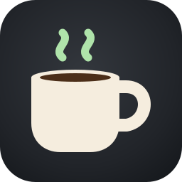
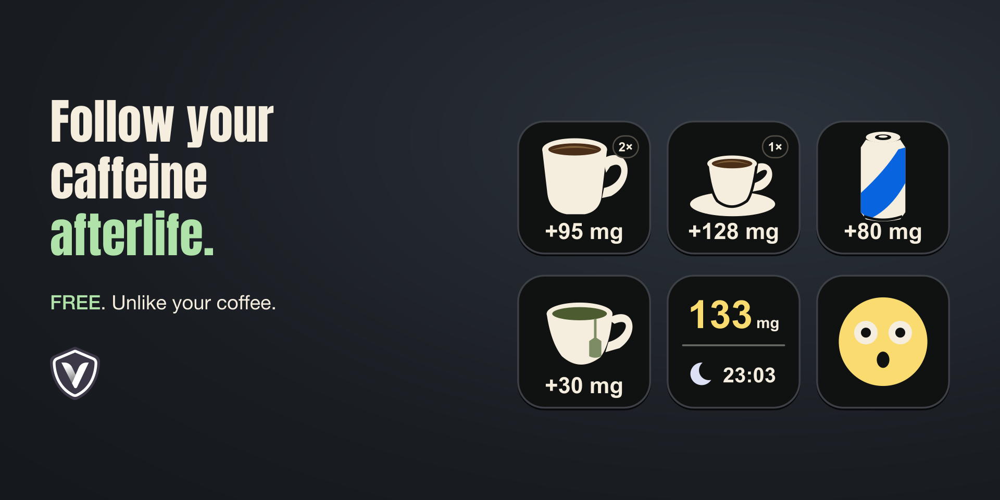
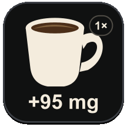
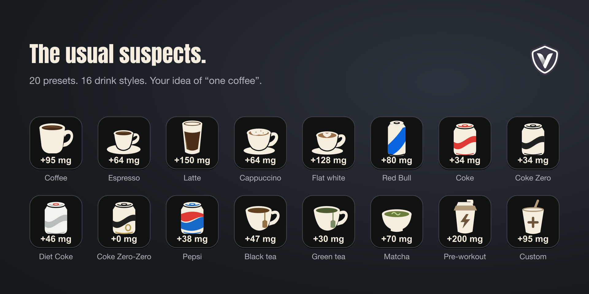
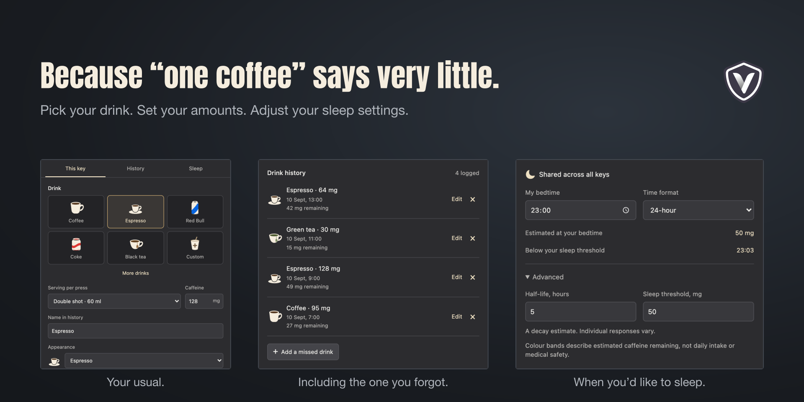

<p align="center">
  
</p>

<h1 align="center">Caffeine Tracker</h1>

<p align="center"><strong>Version 2.0</strong></p>

Follow your caffeine afterlife. Your coffee has a long goodbye.

Log drinks with one tap, track estimated caffeine remaining and get an optional sleep estimate. Choose your drink icons, set your caffeine amounts and add the coffees you forgot to log. Everything stays on your device.

Requires Stream Deck 6.9+, macOS 13+ or Windows 11 (64-bit).

If you find this useful, follow @teamvrotek on GitHub or Instagram. Your support helps us feel more special, thank you.



*All previews use sample data.*

## Install and set up

You need **Stream Deck 6.9+** on **macOS 13+** or **Windows 11 (64-bit)**. The plugin runs on Stream Deck's bundled Node.js runtime. You do not need to install Node.js to use it.

1. Open `com.teamvrotek.caffeinetracker.streamDeckPlugin` on your computer and follow Stream Deck's installation prompt. To create the installer from source, see [Build from source](#build-from-source). The build puts it in `Release/`.
2. Find **Caffeine Tracker** in the action list and drag **Log drink** onto a key.
3. In **This key**, choose a drink and **Serving per press**. Check the **Caffeine** amount against your actual serving and adjust it if needed.
4. Choose an **Appearance**. The artwork and caffeine amount are independent, so you can use any cup or can for a custom drink.
5. Add more **Log drink** keys for your other drinks, then add **Caffeine status** and choose its **Display**.
6. Open **Sleep** and set **My bedtime** and your preferred time format.

For a simple setup, keep drink keys on **Drink only**, with **Show sleep estimate** off. Keep the sleep estimate on your status key. Choose **Drink + status** when you want a drink and the shared total together on one key.

Existing keys keep their saved drink names and caffeine amounts when you update the plugin.

## Tap to log, hold to undo

A short press logs the amount shown on that key. A centred green circle with a white checkmark confirms the save for three seconds, fading during the final 0.6 seconds. The daily count stays visible in the top-right corner.



**Hold any drink key for at least 0.7 seconds** to undo the most recently logged drink across all keys. Pressing **Caffeine status** changes its display and never logs or undoes drinks.

The top-right badge counts drinks logged **today**. Two coffees show **2×**. The amount below the cup is **caffeine per press**, so a double espresso showing `+128 mg` still counts as one drink when logged once.

Counts stay visible after confirmation and reset at local midnight. Entries with the same name share a count across keys and appearances. Undo, deleted drinks and history edits update the count too. Caffeine-free drinks count and add 0 mg.

## Tap to check your status

Choose one **Display** for each **Caffeine status** key:

| Display | What it shows | Tap to see |
|---|---|---|
| Caffeine | Estimated caffeine remaining | Sleep estimate |
| Sleep estimate | When caffeine reaches your sleep threshold | Caffeine |
| Caffeine + sleep | Both estimates together | Status face |
| Status face | A face that changes with estimated caffeine remaining | Caffeine + sleep |

The other display stays visible for five seconds, then your chosen display returns. Press again to return sooner. Each status key keeps its own choice.

The five static faces follow the same caffeine colour bands described below. They reflect estimated caffeine remaining, not how much you have consumed today.

New status keys start with **Caffeine + sleep**. Existing status keys keep both estimates unless **Show sleep estimate** was turned off, in which case they keep the caffeine display.

## Your drinks, your keys

Choose from **20 presets** and **16 duotone appearances**, covering coffee, espresso, latte, cappuccino, flat white, cold brew, black tea, green tea, matcha, energy drinks, cola and pre-workout. Coke, Coke Zero, Diet Coke, Pepsi and caffeine-free Coke Zero-Zero have distinct choices.



Every dose is editable from **0 to 500 mg per press**. Use **Custom** for your own drink, set its **Name in history**, and pick the artwork you want. Names appear in settings and history; the key face uses the picture.

Preset amounts are starting estimates. Serving sizes and recipes vary, so check the product information for what you actually drink.

## Settings, history and sleep

The settings panel has **This key**, **History** and **Sleep** tabs, with a live preview of your key.



Use **History** to add a missed drink with its date and time, correct an entry or delete it. History is shared by every key. It keeps entries from local midnight seven days ago, plus older entries whose estimated caffeine remaining is still at least 0.5 mg.

**Sleep** preferences also apply to every key:

| Setting | Default | Options |
|---|---|---|
| My bedtime | 23:00 | Local time |
| Time format | 24-hour | 12-hour or 24-hour |
| Half-life | 5 hours | 3 to 8 hours, under Advanced |
| Sleep threshold | 50 mg | 25 to 100 mg, under Advanced |

**Estimated at your bedtime** projects your current caffeine estimate to the next occurrence of your chosen bedtime. **Below your sleep threshold** calculates when the estimate reaches your selected threshold. That second time is what the keys show as the sleep estimate.

The key shows `Now` when the estimate is already at or below your threshold. Later dates include `+1d` or another day offset. Times follow local calendar days and daylight saving changes. On drink keys, **Show sleep estimate** can be turned on or off separately. Status keys use their **Display** choice.

## How the estimate works

Each logged dose decays over time using your selected half-life. The plugin adds the remaining amounts together:

```text
remaining_mg = sum(dose_mg × 0.5 ^ (hours_since_drink / half_life_hours))
```

The live number changes colour and the status face changes expression as the estimated amount changes:

| Estimated caffeine remaining | Colour |
|---|---|
| Below 1 mg | Ivory |
| 1 to below 100 mg | Mint |
| 100 to below 200 mg | Yellow |
| 200 to below 400 mg | Amber |
| 400 mg or more | Coral |

These colours describe estimated caffeine remaining, not daily intake or medical safety. The sleep time is an estimate, not a measurement of caffeine in your body or a guarantee that you will sleep well.

## Build from source

Building requires **Node.js 24 or later**, npm, `zip`, `unzip` and a shell that can run `build.sh`.

```bash
git clone https://github.com/teamvrotek/caffeine-tracker.git
cd caffeine-tracker
./build.sh
```

The script installs locked dependencies with `npm ci`, runs the tests, and validates and bundles the plugin files with pinned `@elgato/cli@1.9.0`. The final installer preserves the release version from the source manifest instead of the CLI's padded version. Open `Release/com.teamvrotek.caffeinetracker.streamDeckPlugin` to install it.

The installed plugin uses **Node.js 20**, supplied by Stream Deck.

## Development

Run the tests from the plugin directory:

```bash
cd com.teamvrotek.caffeinetracker.sdPlugin
npm ci
npm test
```

The main source files are:

| File | Responsibility |
|---|---|
| `config.js` | Presets, appearances and settings normalization |
| `caffeine.js` | Decay, local time estimates and history retention |
| `tracker.js` | Shared state, history edits and serialized saves |
| `controller.js` | Stream Deck events, key updates and inspector messages |
| `renderer.js` and `imgs/drinks/` | Key layouts and SVG artwork |
| `plugin.js` | SDK connection, initial settings and periodic refresh |
| `ui/` | Settings panel |

These paths are inside `com.teamvrotek.caffeinetracker.sdPlugin/`.

## Privacy

No account is needed. The installed plugin makes no external network requests. History and preferences stay in Stream Deck's local plugin settings on your computer.

## License

MIT, see [LICENSE](LICENSE). Copyright © 2026 VROTEK OÜ.
