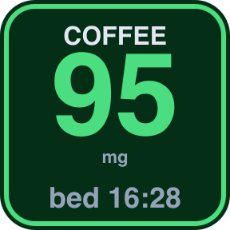
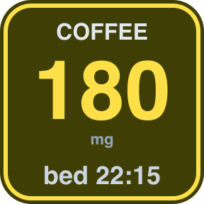
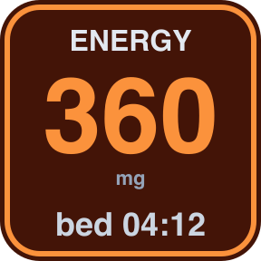
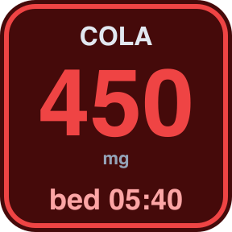

<p align="center">
  
</p>

<h1 align="center">Caffeine Tracker</h1>

<p align="center">
  <strong>Track caffeine in your bloodstream with half-life math, straight from your Stream Deck</strong>
</p>

<p align="center">
  <a href="#how-it-works">How It Works</a> •
  <a href="#install">Install</a> •
  <a href="#settings">Settings</a> •
  <a href="#built-in-presets-click-to-fill">Presets</a> •
  <a href="#full-caffeine-reference-for-custom-entries">Caffeine Reference</a> •
  <a href="#development">Development</a>
</p>

<p align="center">
  
  
  
  
</p>

---

## How It Works

- Each button is configured with a **drink label + dose size in mg** (PI).
- Short press → log one dose of that drink.
- Long press (~0.7s) → undo the most recent dose (any drink, globally).
- Every button shows the **same** current total mg and **same** safe-to-sleep time, because caffeine in your bloodstream is a single number - the buttons just differ in what they log.
- The border + number color change by zone: green (safe) → yellow (fine) → orange (high) → red (over FDA 400mg daily max).

The math:

```
current_mg = Σ  dose.mg × 0.5 ^ ((now - dose.ts) / halfLife)
safe_at    = now + halfLife × log₂(current_mg / threshold_mg)
```

When `current_mg ≤ threshold_mg`, the button shows a check instead of a clock.

## Install

```bash
git clone https://github.com/teamvrotek/caffeine-tracker.git
cd caffeine-tracker
./build.sh
```

Double-click `Release/com.teamvrotek.caffeinetracker.streamDeckPlugin` in Finder to install.

Drop one or more "Caffeine Drink" actions onto your Stream Deck. Configure each with its own drink + dose in the Property Inspector.

## Settings

### Per-button (Property Inspector → This button)

| Setting | Default | What it does |
|---|---|---|
| Drink label | Coffee | Text shown at the top of the button face |
| Dose (mg) | 95 | Amount logged when the button is pressed |

### Built-in presets (click to fill)

| Label      | mg  | What it is |
|---         |---  |--- |
| Espresso   | 64  | Single 1oz shot |
| Coffee     | 95  | Home drip, 8oz |
| Cold Brew  | 205 | 12oz cold brew |
| Latte      | 150 | Grande latte, 2 shots |
| Starbucks  | 310 | Grande Pike Place (16oz) |
| Black Tea  | 47  | Brewed black tea, 8oz |
| Matcha     | 70  | One 2g serving (whisked) |
| Red Bull   | 80  | 8.4oz (250ml) standard can |
| Monster    | 160 | 16oz standard Monster |
| Celsius    | 200 | 12oz Celsius |
| Pre-Wkt    | 200 | Typical pre-workout scoop |
| Coke       | 34  | 12oz Coca-Cola |

### Full caffeine reference (for custom entries)

Everyday caffeine intake varies by brand and preparation. The plugin lets you type a custom mg; use this table if your drink isn't a preset.

**Coffee (home-brewed)**

| Drink | Serving | mg |
|---|---|---|
| Espresso (single) | 1 oz | 63-65 |
| Espresso (double) | 2 oz | 125-150 |
| Drip coffee | 8 oz | 95 |
| Drip coffee | 12 oz | 140 |
| Drip coffee | 16 oz | 190 |
| Pour-over | 8 oz | 105 |
| French press | 8 oz | 107 |
| Cold brew | 8 oz | 100-200 |
| Cold brew | 12 oz | 200-280 |
| Cold brew | 16 oz | 280-360 |
| Latte (2 shots) | any | ~128 |
| Americano (2 shots) | any | ~150 |
| Decaf | 8 oz | 2-5 |

**Starbucks** (official brand numbers)

| Drink | Tall (12oz) | Grande (16oz) | Venti (20oz) |
|---|---|---|---|
| Pike Place Brewed | 235 | 310 | 410 |
| Blonde Roast | 270 | 360 | 475 |
| Cold Brew | 155 | 205 | 310 |
| Nitro Cold Brew | 215 | 280 | - |
| Iced Coffee | 120 | 165 | 235 |
| Americano | 150 | 225 | 300 |
| Latte | 75 | 150 | 150 |
| Flat White | 130 | 195 | 195 |
| Frappuccino (Coffee) | 70 | 95 | 130 |
| Espresso shot (single) | 75 | - | - |

**Energy drinks**

| Drink | Serving | mg |
|---|---|---|
| Red Bull | 8.4 oz (250ml) | 80 |
| Red Bull | 12 oz (355ml) | 110 |
| Monster Energy | 16 oz | 160 |
| Monster Ultra | 16 oz | 150 |
| Rockstar | 16 oz | 160 |
| Celsius | 12 oz | 200 |
| Bang | 16 oz | 300 |
| Reign | 16 oz | 300 |
| C4 Energy | 16 oz | 200 |
| 5-Hour Energy | 2 oz shot | 200 |
| 5-Hour Extra Strength | 2 oz shot | 230 |

**Soda** (12 oz serving)

| Drink | mg |
|---|---|
| Coca-Cola | 34 |
| Diet Coke | 46 |
| Coke Zero Sugar | 34 |
| Pepsi | 39 |
| Diet Pepsi | 35 |
| Pepsi Zero Sugar | 69 |
| Mountain Dew | 54 |
| Diet Mountain Dew | 55 |
| Mountain Dew Kickstart | 90 |
| Dr Pepper | 43 |
| Diet Dr Pepper | 41 |
| Surge | 69 |
| Sprite / 7-Up | 0 |

**Tea** (8 oz unless noted)

| Drink | mg |
|---|---|
| Black tea (brewed) | 40-70 (avg ~47) |
| Green tea | 20-50 (avg ~30) |
| Oolong | 30-70 |
| White tea | 15-30 |
| Matcha (2g whisked) | 60-70 |
| Yerba mate | 70-85 |
| Chai latte (brewed with black) | 50-90 |
| Bottled iced tea | 10-20 |
| Starbucks Chai Latte (grande) | 95 |

**Pre-workout and supplements**

| Product | mg |
|---|---|
| C4 Sport | 135 |
| C4 Original | 150 |
| C4 Ultimate | 300 |
| Bucked Up | 200 |
| BAMF (Bucked Up) | 333 |
| Mother Bucker (Bucked Up) | 400 |
| NoDoz | 200 |
| Vivarin | 200 |
| Jet-Alert (regular) | 100 |
| Jet-Alert (double) | 200 |
| Caffeinated gum (Jolt / Stay Alert) | 100 per piece |

**Chocolate and other**

| Product | Serving | mg |
|---|---|---|
| Dark chocolate (70-80%) | 1 oz | ~20 |
| Dark chocolate (85%+) | 1 oz | ~30 |
| Milk chocolate bar | 1.5 oz | ~10 |
| Hot cocoa | 8 oz | ~5 |
| Coffee ice cream | ½ cup | ~30 |
| Chocolate ice cream | ½ cup | ~3 |
| Awake Chocolate bar | 1 bar | 101 |
| Coca leaves tea (mate) | 8 oz | 80 |

### A few notes

- Numbers are industry averages. Actual content varies with bean varietal (Arabica vs Robusta), roast, brew time, and altitude.
- Starbucks figures come from the company's official nutrition data. Home-brew numbers are from peer-reviewed surveys (CSPI, FDA).
- Decaf is not caffeine-free - it's typically 2-5 mg per 8oz cup.
- Cold brew varies the most: extended steeping time pulls more caffeine per ounce than hot-brewed coffee. Listed values assume ~1:7 coffee-to-water ratio.
- Lighter roasts contain slightly MORE caffeine than dark roasts per volume (the counterintuitive part).

### Global (Property Inspector → Global, affects all buttons)

| Setting | Default | Range | What it does |
|---|---|---|---|
| Half-life hours | 5 | 3 - 8 | Personal metabolism rate. Lower = faster burn-off |
| Sleep-safe threshold (mg) | 50 | 25 - 100 | Level below which sleep isn't meaningfully disrupted |

Global settings live in Stream Deck's shared plugin settings and persist between launches.

## Color zones

| Current mg | Zone | Border |
|---|---|---|
| 0 | empty | slate |
| 1 - 99 | safe | green |
| 100 - 199 | fine | yellow |
| 200 - 399 | high | orange |
| 400+ | over | red (FDA daily max) |

## Development

Layout:

```
caffeine-tracker/
├── PLAN.md                              ← design notes
├── build.sh                             ← zip the .sdPlugin
├── com.teamvrotek.caffeinetracker.sdPlugin/
│   ├── manifest.json
│   ├── plugin.js                        ← main plugin (logging, global state, tick)
│   ├── renderer.js                      ← SVG button face rendering
│   ├── caffeine.js                      ← pure decay + safe-time math
│   ├── caffeine.test.js                 ← math sanity tests
│   ├── render_smoke.js                  ← preview renderer outputs to /tmp
│   ├── package.json
│   ├── imgs/                            ← plugin/category/action icons
│   └── ui/
│       └── property-inspector.html
├── scripts/
│   └── make_icons.mjs                   ← regenerate the icon pack (coffee-cup SVG → PNG @ every size)
├── previews/
└── Release/
```

Run the math tests:

```bash
cd com.teamvrotek.caffeinetracker.sdPlugin
node --test caffeine.test.js
```

Preview button renders (writes SVG + PNG to `/tmp/caffeine-preview/`):

```bash
cd com.teamvrotek.caffeinetracker.sdPlugin
node render_smoke.js
rsvg-convert -w 288 /tmp/caffeine-preview/04-fine.svg -o /tmp/caffeine-preview/04-fine.png
open /tmp/caffeine-preview/
```

## Requirements

- Stream Deck 6.9+
- macOS 10.15+ or Windows 10+
- Node.js 20 (bundled in Stream Deck)

## Privacy

The plugin makes no network requests. All data stays local in Stream Deck's plugin settings.

## Disclaimer

The half-life model is an approximation. Individual caffeine metabolism varies with genetics
(CYP1A2), age, pregnancy, smoking status, and medications. The "safe to sleep" readout is a
helpful guide, not medical advice.

## Sources (for the caffeine reference table)

- Starbucks official nutrition info (via caffeineinformer.com)
- Center for Science in the Public Interest (CSPI) caffeine chart
- Healthline, Mayo Clinic caffeine guides
- Chou & Bell (2007), *Caffeine Content of Prepackaged National-Brand and Private-Label Carbonated Beverages*, Journal of Food Science (for soda numbers)
- Brand product labels (Red Bull, Monster, Celsius, Bang, Rockstar, C4, Bucked Up, Vivarin, NoDoz)
- Caffeineinformer.com (industry reference)

## License

Proprietary, all rights reserved. Copyright © 2026 VROTEK OÜ.

---

<p align="center">
  <sub>Built with caffeine and determination by <a href="https://github.com/TeamVrotek">VROTEK</a></sub>
</p>
